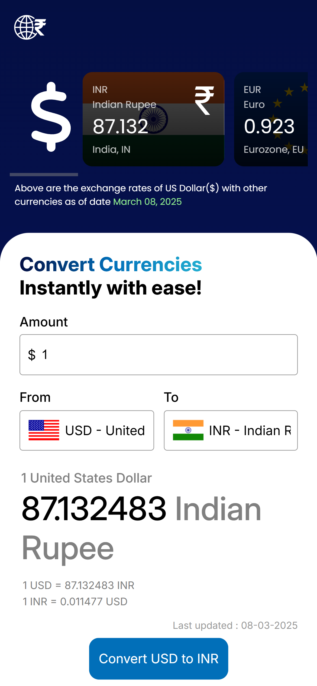
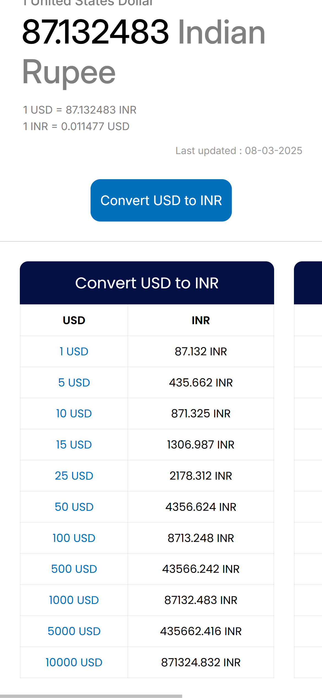
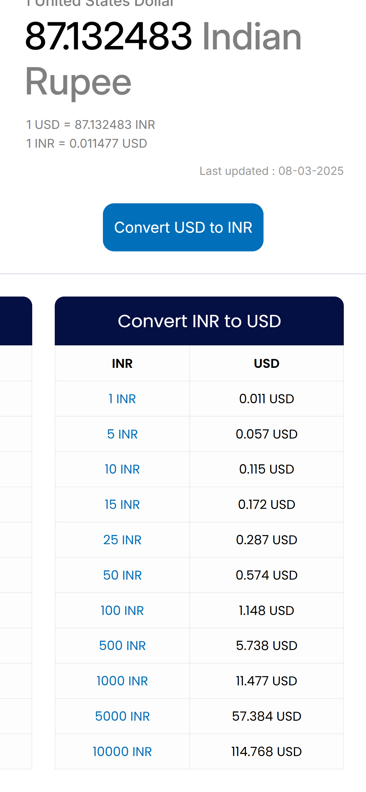

# 🌍 Currency Converter

A simple and user-friendly **Currency Converter** that provides real-time exchange rates. Convert currencies instantly with accurate results and an intuitive design.

## 🚀 Features

- 🔄 **Real-time exchange rates** using API data.
- 🌎 **Supports multiple currencies** with country flags.
- 🔍 **Easy-to-use interface** with dropdown selections.
- 📊 **Displays USD exchange rates** for major currencies.
- 📱 **Mobile-first design** for seamless experience on all devices.
- 📂 **Progressive Web App (PWA) support** (installable).

## 📸 Screenshots

## 🛠️ Technologies Used

- **HTML** + **CSS** (for structure & styling)
- **JavaScript** (dynamic data handling)
- **External API** (_Currency Exchange Rates_)
- **PWA Features** (_manifest.json included_)
